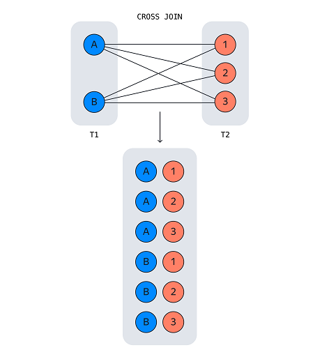

### Функции, возвращающие множества

**GENERATE_SERIES** возвращает множество строк с определённой последовательностью значений в заданном диапазоне.  

```
GENERATE_SERIES(начало_диапазона, конец_диапазона [, шаг_значений])

для возрастающей последовательности - шаг значений положительный
SELECT *
FROM GENERATE_SERIES(0, 5, 1) AS ascending_seq;

для убывающей последовательности - шаг значений отрицательный
SELECT *
FROM GENERATE_SERIES(10, 0, -2) AS descending_seq;
```

Генерировать можно не только целые, но и дробные числа, при этом шаг значений может быть целым или дробным:  
```
SELECT
GENERATE_SERIES(0.1, 5, 1) AS seq_1,
GENERATE_SERIES(15, 0, -2.41) AS seq_2;

seq_1	seq_2
0.1     15
1.1     12.59
2.1     10.18
3.1     7.77
4.1     5.36
[null]	2.95
[null]	0.54
```

Функция вернёт 0 строк, если:  
- Заданный шаг положительный, а стартовое значение больше финального.  
- Заданный шаг отрицательный, а стартовое значение меньше финального.  
- Одно из значений функции равно NULL.  
Если же шаг последовательности задать равным 0, запрос вернёт ошибку.  

**Генерируем множества строковых значений**  
```
SELECT 'order_' || GENERATE_SERIES(1, 5) AS order_number;

order_number
order_1
order_2
order_3
order_4
order_5
```
Чтобы сгенерировать последовательность букв алфавита, понадобятся функции ASCII и CHR:  
```
SELECT
    CHR(ASCII('A') + GENERATE_SERIES(0, 4)) AS eng,
    CHR(ASCII('Я') - GENERATE_SERIES(0, 8, 2)) AS rus;
```

**Генерируем временную последовательность**  
```
SELECT *
FROM GENERATE_SERIES('2023-05-01 00:00'::timestamp, '2023-05-03 12:00', '12 hours') AS time_series;

time_series
2023-05-01 00:00:00
2023-05-01 12:00:00
2023-05-02 00:00:00
2023-05-02 12:00:00
2023-05-03 00:00:00
2023-05-03 12:00:00

Интервалы времени могут соответствовать:
годам — years,
месяцам — months,
неделям — weeks,
дням — days,
часам — hours,
минутам — minutes,
секундам — seconds,
миллисекундам — milliseconds.

Например, интервал в 15 минут записывают так: '15 minutes'.
Можно задавать комбинированные интервалы: например, 1 месяц и 15 секунд — '1 month 15 seconds'.
Также в качестве значений можно задавать дробные интервалы, например '0.25 hours'. 
Указать интервал можно как во множественном числе, так и в единственном. Например, '15 minutes' = '15 minute'.
```

**Перекрёстно соединяем множества**  
Функцию GENERATE_SERIES можно использовать для генерации нескольких множеств, у которых есть  
перекрёстные взаимоотношения.  
В этом случае значения одного множества будут созданы для каждого значения другого множества:  
```
SELECT 
    CHR(ASCII('A') + a) AS first_level, 
    b AS second_level
FROM 
    GENERATE_SERIES(0, 2, 1) AS a, 
    GENERATE_SERIES(10, 13, 1) AS b;
```
Для каждого значения первого множества, представленного последовательностью букв от А до C,  
было создано множество значений от 10 до 13. Это получилось потому, что при генерации во FROM двух множеств,  
указанных через запятую, происходит их перекрёстное (декартово) соединение — аналог CROSS JOIN.  

  

**Генерируем последовательность случайных чисел и букв**  
Например, такой запрос создаст последовательность из пяти случайных чисел от 0 до 100:  
```
SELECT ROUND(RANDOM()*100) AS random_value
FROM GENERATE_SERIES(1, 5, 1) AS seq
```
По аналогии можно сгенерировать множество случайных букв.  
Для этого, так же как со случайными цифрами, нужно добавить к коду ASCII  
первого символа английского алфавита произвольное значение от 0 до 25:  
```
SELECT CHR(ASCII('A') + FLOOR(RANDOM()*26)::integer) AS random_letter
FROM GENERATE_SERIES(1, 5, 1) AS seq
```

Этот запрос сгенерирует десять случайных букв:  
```
SELECT 
    CHR(65 + FLOOR(RANDOM() * 26)::integer) AS random_letters
FROM 
    GENERATE_SERIES(1, 10) AS num_of_letters
```

Затем этот запрос объединит все символы в одну строку с помощью функции STRING_AGG:  
```
SELECT 
    STRING_AGG(CHR(65 + FLOOR(RANDOM() * 26)::integer), '') AS random_letters
FROM 
    GENERATE_SERIES(1, 10) AS num_of_letters;
```

И наконец, этот запрос создаст ещё одно множество значений, которое определит общее количество  
строк (в этом примере — пять строк). Затем соединит множества с помощью перекрёстного соединения и  
сгруппирует по этому столбцу итоговый результат:  
```
SELECT 
    number_of_rows,
    STRING_AGG(CHR(65 + FLOOR(RANDOM() * 26)::integer), '') AS random_letters
FROM 
    GENERATE_SERIES(1, 5) AS number_of_rows, 
    GENERATE_SERIES(1, 10) AS num_of_letters
GROUP BY number_of_rows;

Этот запрос можно ещё оптимизировать — если не нужно выводить значения number_of_rows,
то генерацию этого множества можно сразу вставить в GROUP BY
SELECT STRING_AGG(CHR(65 + FLOOR(RANDOM() * 26)::integer), '') AS random_letters
FROM GENERATE_SERIES(1, 10) AS num_of_letters
GROUP BY GENERATE_SERIES(1, 5);
```

**Генерируем последовательности случайных значений даты и времени**

```
Запрос последовательно добавил для исходной даты '2023‑05‑01 00:00'::timestamp случайное время,
выраженное в часах, — random() * ('24 hours'::interval). 
SELECT '2023-05-01 00:00'::timestamp + RANDOM() * ('24 hours'::interval) AS random_time
FROM GENERATE_SERIES(1, 5);

Чтобы получить случайное множество дат в заданном интервале, нужно привести случайное число от 0 до 10 к целому числу.
Сделать это можно с помощью функции ROUND.
SELECT '2023-05-01'::date + ROUND(RANDOM()*10) * ('24 hours'::interval) AS random_time
FROM GENERATE_SERIES(1, 10); 

С помощью функции GENERATE_SERIES сгенерируйте последовательность дат (stat_date) в интервале
c 1 по 31 августа 2023 года с интервалом в три дня.
SELECT generate_series(
         '2023-08-01'::date,
         '2023-08-31'::date,
         '3 days'
       )::date AS stat_date;
```

**Генерируем последовательность значений при агрегации данных**
Бывает, возникает необходимость создать множество значений с определённой последовательностью, чтобы затем сагрегировать по ним данные.  
Например, нужно подсчитать количество фильмов в таблице movie, вышедших с 2000 по 2010 год включительно:  
```
SELECT movie_year, COUNT(m.film_id) AS movie_num
FROM GENERATE_SERIES(2000, 2010, 1) AS movie_year
LEFT JOIN movie AS m ON movie_year = m.release_year 
-- присоединит таблицу с данными о фильмах
GROUP BY movie_year 
-- сгруппирует данные по году выпуска фильма
ORDER BY movie_year 
-- отсортирует вывод в порядке возрастания года выпуска фильма

Сначала функция GENERATE_SERIES сгенерировала последовательность строк с годами от 2000-го до 2010-го включительно.
Затем присоединились данные по фильмам и подсчиталось количество фильмов за каждый год выхода фильма. 
Изначально таблица movie содержит данные о фильмах, вышедших после 2004 года, и поэтому в результатах 2000–2004 стоят
нули. Такой подход позволяет заполнять пропуски в данных при их агрегации по определённым значениям.
```

Для тестирования базы данных необходимо сгенерировать 50 строк по определённому шаблону:  
user_id — идентификатор пользователя, шесть заглавных букв английского алфавита;  
reg_dt — случайная дата в интервале от 20 до 30 августа 2023 года включительно.  
```
SELECT setseed(0);
SELECT 
    STRING_AGG(CHR(ASCII('A') + FLOOR(RANDOM()*26)::integer), '') AS user_id, 
    '2023-08-20'::date + ROUND(RANDOM()*10)::integer AS reg_dt
FROM 
    GENERATE_SERIES(1, 6, 1) AS char_num,
    GENERATE_SERIES(1, 50, 1) AS line_num
GROUP BY line_num

user_id  reg_dt
JNPSMC	 2023-08-27
...
```

Используя данные таблицы invoice, подсчитайте сумму заказа (total_sum) за каждый день (check_date) в ноябре 2013 года.  
Если в какой-то из дней не было заказов, замените NULL на 0. Результат отсортируйте по дате в порядке возрастания.  
Данные check_date приведите к дате.  
```
select
check_date::date,
sum(
    case
        when total is null then 0
        else total
    end
) as total_sum
from generate_series(
         '2013-11-01'::date,
         '2013-11-30'::date,
         '1 days'
       ) as check_date
left join invoice on invoice_date::date = check_date
group by check_date
order by check_date asc;
```
