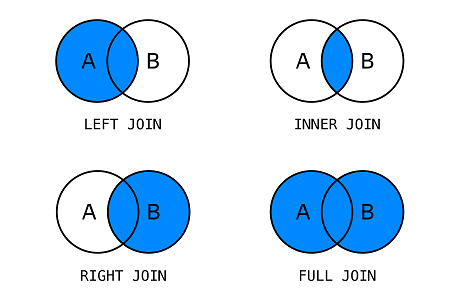
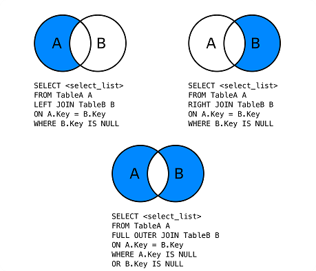
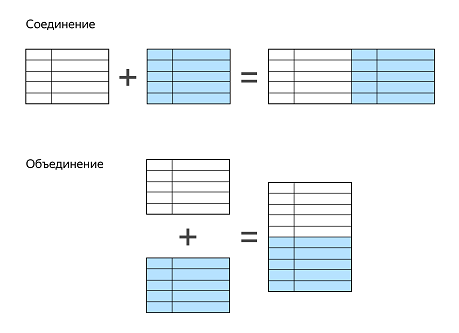

### DQL — Data Query Language
DQL — язык запроса данных. Команды DQL позволяют извлекать данные из базы.  
SELECT, JOIN, UNION, GROUP BY, HAVING  

___

### SELECT
SELECT <столбец 1>, <столбец 2>, … <столбец n>  
FROM <имя_схемы>.<имя_таблицы>;  

```
SELECT * FROM s_test.users; - выгрузить всё
SELECT name, phone FROM s_test.users; 
```

WHERE

SELECT <столбец 1>, <столбец 2>, … <столбец n>  
FROM <имя_схемы>.<имя_таблицы>  
WHERE <условие>;  

```
SELECT phone 
FROM users 
WHERE name = 'Иванов Иван Иванович';
```

___

### Выборка ORDER BY, SORT
ORDER BY ставят:  
после FROM — при выборке всех строк из таблицы,  
после WHERE — при фильтрации данных.  

```
SELECT <столбец 1>, <столбец 2>, … <столбец n> 
FROM <имя таблицы> 
WHERE <условие> -- не обязательно
ORDER BY <параметр сортировки 1>, <параметр сортировки 2>, 
         ... <параметр сортировки n>;
```

Числа, даты и время сортируются по возрастанию значений.  
Строки сортируются в алфавитном порядке A→Za→zА→Яа→я, начиная с заглавных букв английского алфавита, заканчивая строчными русскими.  

```
SELECT name FROM users ORDER BY name ASC;
```

По умолчанию отсутствующие значения (NULL) в сортируемом столбце считаются больше всех остальных значений.  
Они появляются в списке первыми при сортировке по убыванию — DESC и последними в сортировке по возрастанию — ASC.  
Изменить место вывода значений NULL можно командой NULLS LAST/FIRST.  
Её добавляют после указания порядка сортировки.  

```
SELECT id, name, birthday FROM users ORDER BY birthday DESC NULLS LAST;
```

___

### Ограничение выборки — LIMIT N
В реальной практике часто нужно ограничить список заданным количеством строк.  
Например, выбрать три самых дорогих товара или старейшего пользователя.  
Для таких задач запрос SELECT … WHERE дополняют выражением LIMIT N, где N — максимальное количество строк в выдаче.  

```
SELECT name, price 
FROM products 
-- отсортирует по убыванию цены (не забудьте поместить NULLS в конец)
ORDER BY price DESC NULLS LAST 
-- из отсортированного списка возьмёт три первых строки
LIMIT 3; 

SELECT name, birthday 
FROM users 
ORDER BY birthday ASC -- отсортирует пользователей по дате рождения
LIMIT 1 -- возьмёт одного старейшего пользователя;
```

___

### Смещение выборки — OFFSET K
OFFSET ограничивает вывод строк в результате выборки, пропуская вывод первых K строк.  
Например, если запрос SELECT дополнить командой OFFSET 10, вы получите выборку согласно заданным параметрам, но начнётся она с одиннадцатой строки.  
```
SELECT name, price 
FROM products
-- отфильтрует товары, в которых цена не указана
WHERE price IS NOT NULL
-- отсортирует по возрастанию цены
ORDER BY price ASC
-- из отсортированного списка выведет все товары за исключением
-- первых десяти
OFFSET 10; 
```

___

### Пагинация — LIMIT N OFFSET K
Часто ограничение выборки применяют, чтобы разбить её на страницы — сделать пагинацию.  
Практически любой список данных, в котором более пары десятков записей, при выводе на экран делится на страницы.  
Самый простой пример из жизни — пагинация на сайтах интернет-магазинов.  
Вот как это организовано со стороны SQL. Это первая страница:  
```
SELECT name, description
FROM products 
ORDER BY name ASC -- отсортирует по имени
LIMIT 30; -- возьмёт первые 30 записей для первой страницы
```

Для второй страницы списка нужно взять следующие 30 записей.  
Для этого объедините выражения LIMIT N и OFFSET K.  
Порядок ключевых слов LIMIT и OFFSET не влияет на результат.  

```
SELECT name, description
FROM products 
ORDER BY name ASC -- отсортирует по имени
OFFSET 30 -- пропустит первые 30 строк, показанных на первой странице
LIMIT  30 -- возьмёт следующие 30 записей для второй страницы
```

___

```
Несмотря на то, что OFFSET предотвращает вывод строк, сервер БД обрабатывает эти строки, расходуя свои ресурсы.  
Так, запрос с ограничением OFFSET 100000 LIMIT 1 потратит ресурсы на выборку ста тысяч и одной строки, несмотря  
на то, что в результат попадёт максимум одна. OFFSET с большими значениями — ресурсоёмкая операция, поэтому без  
крайней необходимости её лучше не использовать.
```

___

### Удаление дубликатов. DISTINCT
Чтобы отсеять из выборки дубликаты и получить только уникальные значения, применяют оператор DISTINCT.  
Синтаксис запроса с DISTINCT такой:  
```
SELECT DISTINCT category FROM products;

SELECT DISTINCT category 
FROM products 
WHERE amount > 0
ORDER BY category ASC;
```

Если вы просто добавите колонку price к запросу с DISTINCT, то получите вполне ожидаемый, но неправильный результат:  
выгрузяться по каждой категории все товары каждой цены, повторяющиеся цены будут убраны, и категории  
будут не уникальными, а повторяться  
```
SELECT DISTINCT category, price
FROM products
ORDER BY category ASC, price DESC;
```

DISTINCT выдал только уникальные строки, но так как в каждой категории есть товары с разными ценами, выгрузилось количество строк, равное количеству категорий, умноженных на количество различных цен в каждой из них.  
Чтоб такой проблемы не возникало, в PostgreSQL есть команда DISTINCT ON (<столбец 1>,...<столбец n>).  
Эта команда вернёт только строки с уникальными значениями столбцов, указанных в скобках, а для остальных вернёт первое значение в соответствии с порядком сортировки. Если порядок сортировки поля не указан явно, будет использована сортировка по возрастанию (ASC).  
Если в запросе DISTINCT ON есть сортировка ORDER BY, то столбцы, перечисленные в ON(...), нужно перечислить в ORDER BY перед другими параметрами cортировки.  
Для решения своей задачи выполните запрос:  

```
SELECT DISTINCT ON (category) category, price
FROM products
ORDER BY category ASC, price DESC;
```

### CAST преобразование типа данных

Для преобразования значений одного типа в другой в PostgreSQL есть функция CAST. Её общий синтаксис такой:  
CAST(<значение> AS <новый тип>)

Чтобы выгрузить долю проданных товаров, напишите такой запрос:

```
SELECT 
    name, 
    stock_out, 
    stock_in, 
    CAST(stock_out AS real) / stock_in 
FROM stock;
```

Вместо CAST в PostgreSQL также можно использовать короткий оператор ::. Его общий синтаксис такой:

```
SELECT 
    name, 
    stock_out, 
    stock_in, 
    (stock_out::real / stock_in)::numeric(3, 2)
FROM stock;  

SELECT created_at::time FROM users; - из dd.mm.yyyy hh:mm вернет только hh:mm
```

___

### Оператор CASE. Псевдонимы

CASE  
WHEN <условие 1> THEN <результат в случае, если условие 1 верно>  
WHEN <условие 2> THEN <результат в случае, если условие 2 верно>  
-- опционально  
---  
WHEN <условие n> THEN <результат в случае, если условие n верно>  
-- опционально  
ELSE <результат в случае, если ни одно из условий не верно>  
-- опционально  
END;  

```
SELECT 
    name,
    CASE
        WHEN amount > 100 THEN 'Достаточно'
        WHEN amount > 0 THEN 'Заканчивается'
        ELSE 'Отсутствует'
    END
FROM products;
```

Условие CASE можно применять не только при выборке.  
Например, в уроках, где вы изучали обновление данных с помощью команды UPDATE,  
вам пришлось написать три запроса для изменения цен на разные категории товаров.  
Написав запрос с CASE, можно обновить все данные за один раз:  
```
UPDATE products
SET price = CASE
      WHEN category IN ('Средства гигиены', 'Косметика') THEN price * 1.1
    WHEN category IN ('Продукты питания', 'Напитки') THEN price * 1.05
    ELSE price * 1.15
END;
```

Такой запрос выдаст всех пользователей из таблицы users с пометкой 'XXI', рождённых в XXI веке.  
У остальных в этой колонке будет NULL:  
```
SELECT
    name,
    CASE
        WHEN birthday >= '2001-01-01' THEN 'XXI'
    END
FROM users;
```

Второй столбец выборки получил заголовок case — это неинформативно. Можно использовать алиасы.

### ALIAS. Псевдоним для объекта
В этом примере колонка name получила псевдоним user, а вычисляемая колонка — псевдоним century.  
Для первой использовали ключевое слово AS, для второй обошлись без него — на результат это не влияет.  
```
SELECT
    name AS user,
    CASE
        WHEN birthday >= '2001-01-01'::DATE THEN 'XXI'
        WHEN birthday >= '1901-01-01'::DATE THEN 'XX'
          ELSE 'Не указан'
    END century
FROM users;
```

В SQL псевдонимы можно присваивать не только столбцам, но и таблицам. Синтаксис такой же.  

```
SELECT name, email FROM users u;

-- псевдоним таблицы можно использовать как префикс к имени столбца
SELECT u.name, u.email FROM users u; 
```

### JOIN соединение таблиц

Все соединения делят на два основных случая:  
- перекрёстное соединение, или декартово произведение таблиц,  
- соединения с сопоставлениями строк.  

**Декартово произведение** - каждая строка одной таблицы соединяется с каждой другой строкой второй таблицы.  
Если таблиц несколько, то все строки всех таблиц комбинируются между собой таким образом,  
чтобы получить все возможные сочетания строк. Количество строк итоговое = перемножению строк таблиц.  
Первая таблица 2 строки, вторая 4, третья 3 - результирующая таблица 2 * 4 * 3 = 24 строки.  

```
SELECT * FROM clients, products;
или
SELECT * FROM clients CROSS JOIN products;
```

**Сопоставление строк** - Чтобы соединить две таблицы с помощью сопоставления строк,  
нужно прописать условие их соединения. Условия бывают разными, но чаще всего соединения  
производят через столбец, на который наложено ограничение внешнего ключа.  

Всего существует четыре типа таких соединений.  

1. Внутреннее соединение — INNER JOIN, или просто JOIN.  
2. Внешние соединения:  
   2.1. Левое внешнее — LEFT OUTER JOIN, или LEFT JOIN.  
   2.2. Правое внешнее — RIGHT OUTER JOIN, или RIGHT JOIN.  
   2.3. Полное внешнее — FULL OUTER JOIN, или FULL JOIN.  

  

SELECT *  -- здесь можно перечислить отдельные столбцы или вычисляемые выражения  
FROM left_table  
[уточнение_типа_соединения] JOIN right_table  -- уточнение опционально  
ON условие_соединения; (в CROSS JOIN не применяется, только фильтр WHERE)  

```
SELECT *
FROM left_table
JOIN right_table
ON left_table.id = right_table.foreigh_key_id;

SELECT *
FROM clients, purchases 
WHERE clients.id = purchases.client_id;
```
```
соединение 3-х таблиц
SELECT *
FROM clients
INNER JOIN (purchases INNER JOIN products ON purchases.product_id = products.id) - можно и без скобок
ON clients.id = purchases.client_id;

более читаемы вариант соединения 3-х таблиц
SELECT *
FROM clients
JOIN purchases ON clients.id = purchases.client_id
JOIN products ON purchases.product_id = products.id;
```
```
отобразить определенные данные, здесь не данных таблицы purchases, но она есть в JOIN, без нее данных не получить
SELECT 
    clients.surname,
    clients.name,
    products.name,
    products.type
FROM clients
JOIN purchases ON clients.id = purchases.client_id
JOIN products ON purchases.product_id = products.id;
```
Если названия столбцов уникальны для соединённой таблицы (как surname и type в примере выше),  
то исходные таблицы в запросе можно не указывать:  
```
SELECT surname, type FROM ...

SELECT surname, type, name FROM ... - получи ошибку, потому что name есть в обеих таблицах

SELECT surname, type, products.name FROM ... - OK
```

Другие типы соединений:  
  
У этих типов соединения нет конкретного названия. Здесь такие варианты:  
1. строки левой таблицы, которых нет в правой;  
2. строки правой, которых нет в левой;  
3. уникальные строки левой и правой таблиц.  

Пример, чтобы узнать пользователей, которые ничего не купили:  
```
SELECT *
FROM clients
LEFT OUTER JOIN purchases
ON clients.id = purchases.client_id
WHERE purchases.id IS NULL;
```

**Использование псевдонимов**  
Псевдоним становится новым именем таблицы в рамках запроса.  
Это значит, что если мы назначили таблице псевдоним, то нельзя использовать в этом запросе исходное имя таблицы.  
```
SELECT 
    clients.surname,
    clients.name,
    products.name,
    products.type
FROM clients
JOIN purchases ON clients.id = purchases.client_id
JOIN products ON purchases.product_id = products.id;

SELECT 
    c.surname,
    c.name,
    pr.name,
    pr.type
FROM clients c
JOIN purchases pu ON c.id = pu.client_id  -- у нас 2 таблицы на букву p, поэтому pu
JOIN products pr ON pu.product_id = pr.id;  -- а тут pr
```

**Соединение таблицы с самой собой**  
Иногда псевдонимы используют не для удобства, а по необходимости — бывают ситуации,  
когда запрос можно написать только с псевдонимами, а без них не получится.  
Например, когда таблица соединяется сама с собой.  
Разберём на примере. Создадим таблицу менеджеров.  
Некоторые из них могут быть руководителями других менеджеров:  

```
CREATE TABLE people (
id SERIAL PRIMARY KEY,
name character varying NOT NULL, -- имя
manager_id integer  -- ссылка на руководителя
);
```

Получается, в столбце manager_id может быть указан человек из той же таблицы.  
Выполним запрос, который получит всех руководителей и их подчинённых. Для этого надо присвоить  
таблице people два разных псевдонима, а затем соединить её с самой собой и прописать условие соединения.  
```
SELECT manager.name AS manager_name, subordinate.name AS subordinate_name
FROM people AS manager 
JOIN people AS subordinate ON manager.id = subordinate.manager_id;
```

### Альтернативный синтаксис соединения таблиц

**USING** - когда названия нужных для соединения столбцов в двух таблицах совпадают.  

SELECT *  
FROM left_table  
[уточнение типа соединения] JOIN right_table  
USING (столбцы для соединения)  

```
старый способ
SELECT *
FROM clients c
JOIN purchases p
ON c.client_id = p.client_id;

способ USING
SELECT *
FROM clients c
JOIN purchases p
USING (client_id);
```

**NATURAL** - когда таблицы соединяются по одноимённым столбцам, есть и ещё более короткая форма записи. Вместо перечисления столбцов после ключевого слова USING и указания каких-либо условий после ON можно просто написать после идентификатора левой таблицы ключевое слово NATURAL, и тогда PostgreSQL сам обнаружит совпадающие имена столбцов и попробует объединить таблицы по ним.  

```
SELECT * FROM clients NATURAL JOIN purchases;
```

Результат будет таким же, как и с USING — таблицы объединены по client_id, дублирующиеся столбцы не выводятся.  
При использовании NATURAL возможны проблемы:  
1. Если в таблице есть столбцы, которые называются одинаково, но не предназначены для соединения, результат окажется пустым. Например, столбец name есть в таблицах clients и products. В первой таблице он содержит имена клиентов, а во второй — названия товаров. Объединение по этому столбцу даст пустую таблицу.  
2. Если в таблицах не найдётся одинаковых имён для столбцов, то запрос выведет декартово произведение таблиц. В этом случае он может выполняться долго и «подвесить» клиент базы данных для больших таблиц.  

**Соединение по произвольным полям**  

```
SELECT *
FROM clients c
JOIN purchases p
ON c.surname = p.surname AND c.name = p.name;

SELECT *
FROM clients
JOIN purchases
USING (surname, name);

SELECT 
    a.actor_id,
    a.first_name,
    a.last_name,
    c.customer_id,
    c.first_name,
    c.last_name
FROM actor AS a
JOIN client AS c 
ON a.last_name = c.last_name
ORDER BY c.last_name;
```

### Операторы сочетания запросов UNION, INTERSECT, EXCEPT.



«Вертикальные» операции с таблицами — это объединение, пересечение и вычитание, а также их сочетания.  
Эти операции можно провести, если:  
- Количество столбцов в выборках совпадает.  
- Типы сочетаемых столбцов в выборках совместимы. Например, целые и дробные числа сочетать можно, а целые числа и текст — нет.  

**UNION** - объединяет выдачу SQL-запросов.  

Обратите внимание: сортировка, а также выражение LIMIT в подобных запросах относятся к результирующей таблице, и указать их можно только в конце запроса. Если вы хотите ограничить выдачу или отсортировать данные в отдельном SELECT-запросе, его надо будет заключить в круглые скобки.  

```
SELECT 1 as id, 'Hello,' as word
UNION
(SELECT * FROM (VALUES (2, 'dear'), (2, 'dear again')) AS temp_table LIMIT 1)
UNION
SELECT 3, 'world!'
ORDER BY id;
```

По умолчанию UNION удаляет все дубликаты строк, и вот в таком запросе:  
```
SELECT 1 UNION SELECT 1;  
```
вернётся только одна строка с числом 1. Можно оставить в запросе все строки, в том числе дубликаты. Для этого нужно указать после UNION ключевое слово ALL (англ. — все).  
```
SELECT 1 UNION ALL SELECT 1;  
```
В этом случае вернётся две одинаковых строки — в каждой будет по единице.  

```
SELECT last_name, first_name 
FROM client 
WHERE city = 'Edmonton'

UNION

SELECT last_name, first_name 
FROM staff 
WHERE city = 'Edmonton';
```

**INTERSECT и EXCEPT** - объединяет выдачу SQL-запросов.  

INTERSECT помогает находить общие строки в результатах двух или более выборок.  
EXCEPT вычитает строки одного запроса из другого.  

```
SELECT product_name FROM products_in_stock
INTERSECT
SELECT product_name FROM popular_products;

В результате мы получим таблицу с популярными товарами, которые есть в наличии.
```
```
SELECT product_name FROM popular_products
EXCEPT
SELECT product_name FROM products_in_stock;

Получим список популярных товаров, которых нет в наличии.
```

**Комбинации операторов**  
```
(SELECT 1 UNION SELECT 2)   -- шаг 1
INTERSECT                   -- шаг 3
(SELECT 2 UNION SELECT 3);  -- шаг 2

на первом шаге мы получили выборку из двух строк с числами 1 и 2,
на втором шаге — получили выборку из двух строк с числами 2 и 3,
на третьем шаге получаем пересечение выборок из 1 и 2 шага, то есть
их общие строки — это единственная строка с числом 2.
```
```
SELECT 1 UNION SELECT 2   -- шаг 2
INTERSECT                 -- шаг 1
SELECT 2 UNION SELECT 3;  -- шаг 3

Порядок шагов поменялся. Без круглых скобок UNION и EXCEPT объединяются
слева направо, но оператор INTERSECT имеет больший приоритет, чем первые
два. Таким образом, сначала  будет вычислен запрос SELECT 2 INTERSECT SELECT 2 — в результате
получится строка с числом 2. Затем запрос выполнит остальные шаги.
В итоге выведутся три строки с числами 1, 2, 3.
```

### UPDATE для связанных таблиц

```
UPDATE <имя_таблицы_1> -- таблица, в которой надо обновить значения
        SET 
                -- что именно надо обновить
            <имя_столбца 1> = <значение 1>,
            <имя_столбца 2> = <значение 2>,
            ...
            <имя_столбца n> = <значение n>
FROM <имя_таблицы_2> -- таблица, в которой ищем условие
WHERE
    -- условие соединения таблиц <имя_таблицы_1> и <имя_таблицы_2> 
    <имя_таблицы_1>.поле = <имя_таблицы_2>.поле 
    AND <условия на ограничения данных>;

если нужно отобразить результат, то в конце можно добавить
RETURNING p.*;

UPDATE purchases AS p -- таблицу, в которую вносим обновление
    SET 
        billing_city = 'Стамбул',
        billing_country = 'Турция'
FROM clients AS cl -- связанная таблица
WHERE
    p.client_id = cl.id -- условие соединения таблиц
    AND -- условия на ограничения выборки
    ((cl.name = 'Роберт' AND cl.surname = 'Иванов') -- поиск клиента Роберт Иванов
    OR
    (cl.name = 'Антон' AND cl.surname = 'Земекис')) -- поиск клиента Антон Земекис
    AND p.purchase_date >= '2023-05-23' -- ограничение по дате поставки 23.05.2023г.
    AND p.purchase_date < '2023-05-24'
RETURNING p.*; 

UPDATE clients AS cl -- таблица, в которую вносим правки
    SET phone = '112-83-75'
FROM purchases AS p -- первая связанная таблица
INNER JOIN products AS pr --вторая связанная таблица
ON (pr.id = p.product_id) -- соединение второй связанной таблицы 
WHERE
    p.client_id = cl.id -- условие соединения таблиц clients, purchases
    AND pr.name = 'Азбука' -- ограничение по наименованию товара
    AND p.purchase_date >= '2023-06-01' -- ограничение по месяцу 06.2023г.
    AND p.purchase_date < '2023-07-01'
    AND cl.phone IS NULL; -- номер телефона не заполнен 
```

### DELETE для связанных таблиц

```
DELETE FROM <имя_таблицы_1> -- таблица, из которой удаляем данные
USING <имя_таблицы_2> -- связанная таблица

WHERE 
    -- условия соединения таблиц <имя_таблицы_1> и <имя_таблицы_2>
    <имя_таблицы_1>.поле = <имя_таблицы_2>.поле
    
    
DELETE FROM purchases AS p
USING clients AS cl
WHERE
    p.client_id = cl.id -- условие соединения таблиц
    AND -- условия на ограничения выборки
    ((cl.name = 'Роберт' AND cl.surname = 'Земекис') -- поиск клиента Роберт Земекис
    OR -- или
    (cl.name = 'Антон' AND cl.surname = 'Иванов')) -- поиск клиента Антон Иванов
    AND p.billing_city = 'Париж'; -- ограничение по городу платежа

```

Для трёх связанных таблиц:  
```
DELETE FROM <имя_таблицы_1> -- таблица, из которой удаляем данные
USING <имя_таблицы_2>, <имя_таблицы_3> [, ...] -- связанные таблицы

-- соединения таблиц через имя_таблицы_n, <имя_таблицы_n+1>
[тип_соединения] JOIN <имя_таблицы_n> ON <имя_таблицы_n>.поле = <имя_таблицы_n+1>.поле

WHERE 
    -- условия соединения таблиц <имя_таблицы_1> и <имя_таблицы_2>
    <имя_таблицы_1>.поле = <имя_таблицы_2>.поле
    -- условия соединения таблиц <имя_таблицы_2> и <имя_таблицы_3>
    AND имя_таблицы_2>.поле = <имя_таблицы_3>.поле 
    AND <условия на ограничения данных>;
    
SELECT
    p.*
FROM  purchases AS p, clients AS cl, products AS pr
WHERE
    cl.id = p.client_id -- условие для соединения purchases и clients
    AND p.product_id = pr.id -- условие для соединения purchases и products 
    AND pr.type = 'Аудиотрек' -- ограничение по типу товара
    AND cl.phone IN ('654-42-18', '321-55-91'); -- ограничение по номерам телефонов
```

Используя JOIN:  
```
DELETE FROM purchases AS p
USING products AS pr
-- соединение таблиц products и countries
INNER JOIN countries AS c ON (c.id = pr.country_making_id) 
WHERE
    pr.id = p.product_id  -- условие для соединения purchases и products 
    AND c.country_name = 'Крауджиния'; -- ограничение на страну производителя
```
