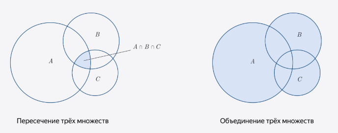
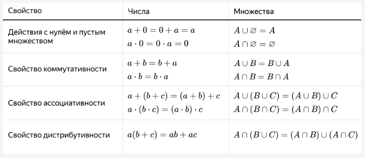
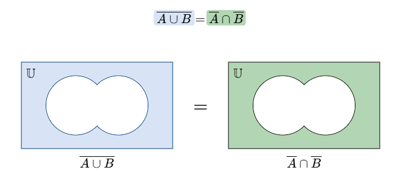
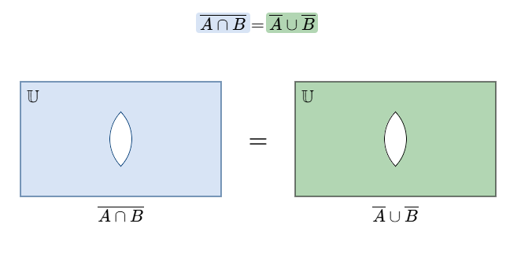

### Пересечение и объединение множеств

∪ - объединение  
∩ - пересечение  

Когда Множество A относится к BC аналогично отношению B и C, то это свойство ассоциативности  

A∪(B∪C)=(A∪B)∪C  
A∩(B∩C)=(A∩B)∩C  

Когда Множество A относится к BC противоположно отношению B и C, то это свойство дистрибутивности  

A∪(B∩C)=(A∪B)∩(A∪C)  
A∩(B∪C)=(A∩B)∪(A∩C)  

Действие с нулем и пустым множеством  

A∪∅=A  
A∩∅=∅  

Свойство коммуникативности  

A∪B=B∪A  
A∩B=B∩A  

Пересечение трёх множеств состоит только из элементов, которые встречаются в записи всех трёх множеств одновременно.  

___

### Универсум

Универсальное множество, или универсум, содержит в себе все элементы заданного признака. Все другие множества являются его подмножествами.  

При объединении универсума с любым множеством получается универсальное множество, при пересечении — исходное множество.

A∪U=U  
A∩U=A  

___

### Дополнение и отрицание

Пусть наш универсум U = множество фруктов.  
Множество A = цитрусовые.  
Множество фруктов, которые не являются цитрусовыми, образуют дополнение к множеству A.  

Дополнением к множеству A (или его отрицанием) называют множество, которое состоит из всех элементов, не лежащих в A.  
Его обозначают A&#773;.  

A∪A&#773;=U  
A∩A&#773;=∅  
U&#773;=∅  
A&#773;&#773;&#773;=A  

___

### Закон Огастеса де Мо́ргана №1

Дополнение(отрицание) объединения равно пересечению дополнений(отрицаний):  
A&#773;U&#773;B&#773;=A&#773;&#8745;B&#773;  
т.е. ‾𝐴∪‾𝐵 это область вне 𝐴∪𝐵, это одновременно «не из A» и «не из B», то есть пересечение A&#773;&#8745;B&#773;  
все элементы, не являющиеся объединением А и В

 ___

### Закон Огастеса де Мо́ргана №2

Дополнение(отрицание) пересечения равно объединению дополнений(отрицаний):  
‾𝐴∩‾𝐵=‾𝐴∪‾𝐵  
т.е. ‾𝐴∩‾𝐵 это область вне 𝐴∩𝐵, т.е. включает всё, что не лежит одновременно в обоих множествах — это «не из A или не из B» т.е. ‾𝐴∪‾𝐵  
все элементы, не являющиеся пересечением А и В

 ___

> По сути, законы де Мо́ргана это отрицание объединения и пересечения.

___

### Разность множеств

Разность множеств A и B — это множество, в которое входят элементы множества A, не лежащие в B. (A∖B)  
Про дополнение в таком случае можно сказать, что ‾A=U∖A.

A∖A=∅  
A∖B=A

___

### Симметрическая разность

Симметрической разностью A △ B множеств A и B называют множество, куда входят все элементы исходных множеств, не принадлежащие их пересечению.  

Можно сказать, что это объединение разностей множеств: сначала A вычитаем из B, затем B из A.  
Или наоборот! Можно в любом порядке. Ещё подобную операцию называют «xor», то есть «исключающее или».  
(a && !b) || (!a && b)  
К примеру с тренировками, то это те дни, когда есть только тренировка по йоге или только бассейн.  
Для симметрической разности не имеет значения, какое множество из какого мы «вычитаем».  

A 1-50  
B 2-51

___

### Мощность множества

Мощность конечного множества равна числу его элементов.  

Мощность множества A обозначается как |A|.  
Например, мощность пустого множества равна нулю, и это можно записать как |∅| = 0, а мощность множества  
T={1,5,7,9}  
|T| = 4

___

### Правило сравнения

Два множества А и В называют равномощными, если число элементов в них совпадает.  

Важно не путать равномощные множества с равными, это не одно и то же. Равные множества всегда равномощные, а вот равномощные не обязательно равны: у них совпадает только количество элементов, но сами элементы могут быть и разными.  

___

### Правило суммы

Правило суммы: мощность объединения двух не пересекающихся множеств равна сумме мощностей этих множеств.  

___

### Правило произведения

Декартово произведение множеств A и В — это множество всевозможных пар, первый элемент которых принадлежит множеству A, а второй множеству B.  

Правило произведения можно сформулировать и так: мощность декартова произведения множеств равна произведению мощностей этих множеств.  

