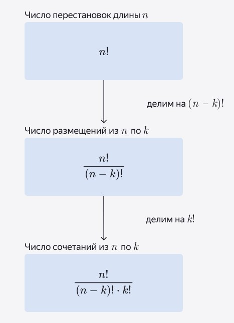

### Рекуррентная формула для факториала

Каждый факториал содержит в себе предыдущий — как большая матрёшка, которая содержит в себе матрёшку поменьше и заодно все матрёшки, что были у той внутри.  

Это свойство упрощает вычисления: чтобы из какого-то факториала получить следующий, достаточно домножить его всего на одно новое число.  
```
!7 = 7 * !6
```
___

```
Правило суммы — если объект A можно выбрать n способами, а объект B можно выбрать m способами,
то объект A или B можно выбрать n + m способами
```
т.е. когда важно одно **ИЛИ** другое — мы всегда **складываем**.

```
Правило произведения — если объект A и после каждого такого выбора объект B можно выбрать m способами,
то для пары A и B есть n * m вариантов выбора.
```
т.е. когда важно одно **И** другое — **умножаем**.
___

### Перестановки
Допустим, на полке стоят три виниловых пластинки. Если поменять их
расположение на полке, получится новая перестановка.  

Перестановка n объектов/элементов — это способ их последовательного
расположения с учётом порядка.  

Например: abc, bca и cab — это разные перестановки из трёх букв.  

Важно: перестановка — это не процесс перетасовки элементов, а результат их
расположения.  

Перестановку объектов ещё называют перестановкой длины n. Количество
всех таких перестановок обозначается как P<sub>n</sub>.  

Чему равно P<sub>3</sub>? То есть сколько существует всевозможных перестановок длины 3?  

На первом месте может оказаться любой из трёх элементов, на втором — любой
из оставшихся двух, а на третьем — только один последний.  

По правилу произведения получается 3 &bull; 2 &bull; 1 = 6, что возможно 6 вариантов. Значит, три
пластинки можно расставить на полке шестью способами P<sub>n</sub> = n!.
___

### Размещения

**порядок важен**  
Размещения из n по k это **упорядоченный набор** из k различных элементов, взятых из некоторого множества с мощностью n, где k &#8804; n.  
A<sup>k</sup><sub>n</sub>  
Если нужно выбрать 4 человек из 9  
A<sup>4</sup><sub>9</sub>  
!9/(9 - 4)!  
(5! * 6 * 8 * 9)/5!  
сокращаем 5!  
9 &bull; 8 &bull; 7 &bull; 6 = 3024  
Это похоже на «укороченную» перестановку: порядок важен, но количество слотов меньше общего количества элементов.

### Сочетания

**порядок не важен**  
Cочетание из n по k это **неупорядоченный набор** из k различных элементов, взятых из некоторого множества с мощностью n, где k &#8804; n.  
C<sup>k</sup><sub>n</sub> = (A<sup>k</sup><sub>n</sub>)/k!  
!9/((9 - 4)!  &bull; !4)

  

Итак, сочетания применяют, если порядок не важен. Такое бывает, когда:  
Выбирают несколько элементов одновременно.
- В учебниках по математике самый частый пример — мешок с шариками, откуда вытаскивают несколько шариков за раз.  

Выбирают пару (тройку, группу) для взаимного или равноправного процесса.  
- Например, двух человек для партии в шахматы, две команды для игры в хоккей, три бренда одежды для коллаборации, две точки для соединения отрезком, пять человек для хора.  

Сколько треугольников можно построить внутри 16-угольника, соединяя 3 любые его вершины?  
C<sup>3</sup><sub>16</sub> = 560  

---

### Пространство исходов
Это множество всех исходов. Оно описывает все возможные варианты того, что может случиться в результате эксперимента. Обозначается греческой буквой омега &Omega;  
Элементы &Omega; обозначают &omega;<sub>n</sub> - где n - количество исходов эксперимента.  

**Событие** — это набор исходов случайного эксперимента, удовлетворяющий определённым условиям. Или, по-другому, подмножество &Omega;  
Условия формулируются словами. Например, «число очков на кубике чётное» — это событие.  
События обозначают заглавными буквами латинского алфавита A, B, C.  
A = {число очков на кубике чётное} = {&omega;&isin;&Omega;: &omega; &#8942; 2} = {2,4,6}  
&Omega; = {1,2,3,4,5,6}  
: = «для которого выполняется условие»  
&omega; &#8942; 2 = элементарный исход делится на 2 (чётный)  
Все те исходы &omega;, которые принадлежат событию A (т.е. &omega; &isin; A) называются благоприятными исходами для события A.  
